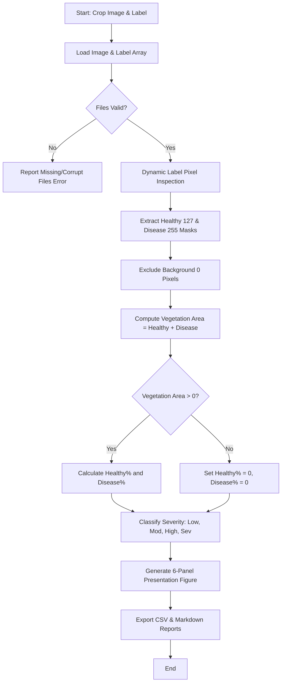

# 🌿 ACADEMIC PROJECT REPORT
# CROP HEALTH AND DISEASE SURVEILLANCE

**Sub-Title**: Image Processing Based Crop Disease Segmentation and Severity Estimation  
**Domain**: Computer Vision, Digital Image Processing (DIP) & Precision Agriculture  
**Document Version**: 1.0.0 (Final Academic Submission)  
**Date**: September 2026  

---

## 1. COVER PAGE

```text
================================================================================
                    CROP HEALTH AND DISEASE SURVEILLANCE
   An Image Processing Pipeline for Automated Vegetation Stress & Infection
                          Severity Estimation
================================================================================
                       Academic Engineering Project
                             Submitted for
                  Bachelor of Technology / Mini-Project
================================================================================
```

---

## 2. AIM
To design, implement, and validate a deterministic, non-machine-learning digital image processing pipeline capable of segmenting healthy vs. diseased plant vegetation, calculating exact disease-affected area percentages, and classifying infection severity levels suitable for integration with drone-based crop surveillance systems.

---

## 3. PROBLEM STATEMENT
Crop diseases pose a massive threat to global agricultural security. Farmers frequently discover fungal and bacterial infections only after visible, irreversible foliage damage has occurred, leading to substantial crop yield loss. Manual field inspection is labor-intensive, subjective, and unfeasible across large farmland holdings. 

Unmanned Aerial Vehicles (UAVs / Drones) offer a rapid solution for wide-area crop monitoring. However, automated surveillance requires lightweight, transparent, and reproducible image processing algorithms that can quantify disease extent without high computational overhead or GPU dependency.

---

## 4. OBJECTIVES
The primary objectives of this project are:
1. **Vegetation & Region Segmentation**: Extract healthy foliage and diseased lesion regions from field imagery using deterministic color-space transformations and ground-truth segmentation label parsing.
2. **Quantitative Area Ratio Estimation**: Calculate exact healthy area percentages and disease-affected area percentages without including background non-leaf pixels in the denominator.
3. **Infection Severity Classification**: Categorize sample infection levels into project-defined severity tiers (*Low*, *Moderate*, *High*, *Severe*) and generate actionable agricultural advisories.
4. **Academic Documentation & Viva Readiness**: Develop an interactive Streamlit dashboard, a batch processing engine, and formal reporting utilities suitable for academic presentation and defense.

---

## 5. DATASET DESCRIPTION
This project utilizes the **Kaggle Field-Acquired Plant Disease Dataset** ([Alex Chen](https://www.kaggle.com/datasets/alexzcheny/testdataset)).

### Supported Categories:
1. `wheat_stripe_rust` (*Puccinia striiformis*): Fungal yellow-orange pustules aligned along leaf veins.
2. `soybean_bacterial_blight` (*Pseudomonas syringae*): Angular brown lesions with yellow chlorotic halos.
3. `cedar_apple_rust` (*Gymnosporangium juniperi-virginianae*): Bright yellow-orange leaf lesions on apple leaves.

### Sample File Triplet Structure:
- `<sample_id>.jpg`: Original RGB field image ($640 \times 640$ pixels).
- `<sample_id>_black.png`: Background-removed leaf image.
- `<sample_id>_label.png`: Ground-truth segmentation label mask ($640 \times 640$ uint8 grayscale).

> **Important Dataset Context Note**: The images in the Kaggle dataset are field-acquired high-resolution close-up canopy shots, not direct aerial drone payload images. This project demonstrates an algorithmic image-processing pipeline designed as a prototype that can be integrated directly with high-resolution aerial imagery acquired by crop-monitoring drones.

---

## 6. PROPOSED SOLUTION
The proposed solution implements a classical computer vision pipeline (OpenCV & NumPy) that operates deterministically without machine learning models (CNN / YOLO / PyTorch).

### Core Advantages of Classical CV Approach:
- **Zero GPU Overhead**: Lightweight memory footprint suitable for onboard drone microcontrollers (e.g. Raspberry Pi / Jetson Nano).
- **Physical Interpretability**: Direct pixel intensity ratios replace black-box neural network predictions.
- **Dynamic Label Calibration**: The `LabelInspector` module parses `*_label.png` files dynamically without relying on hardcoded pixel assumptions.

---

## 7. SYSTEM ARCHITECTURE

```
┌─────────────────────────┐
│ Input Image & Label     │
│ (*.jpg & *_label.png)   │
└────────────┬────────────┘
             │
             ▼
┌─────────────────────────┐
│ Preprocessing           │
│ (Gaussian Filter, HSV)  │
└────────────┬────────────┘
             │
             ▼
┌─────────────────────────┐
│ Label Inspector & Mask  │
│ (Extract 0, 127, 255)   │
└────────────┬────────────┘
             │
             ▼
┌─────────────────────────┐
│ Background Removal      │
│ (Exclude 0 Pixels)      │
└────────────┬────────────┘
             │
             ▼
┌─────────────────────────┐
│ Area Ratio Calculation  │
│ (Healthy % & Disease %) │
└────────────┬────────────┘
             │
             ▼
┌─────────────────────────┐
│ Severity Classifier     │
│ (Low, Mod, High, Sev)   │
└────────────┬────────────┘
             │
             ▼
┌─────────────────────────┐
│ Dashboard & Report      │
│ (Streamlit, CSV, MD)    │
└─────────────────────────┘
```

---

## 8. METHODOLOGY
The processing workflow consists of 6 sequential stages:
1. **Input Validation**: Verifies that both the original `.jpg` image and matching `*_label.png` file exist and are readable.
2. **Label Profiling**: `LabelInspector` examines pixel intensity frequencies to map background, healthy tissue, and disease spot classes dynamically.
3. **Foliage Isolation**: Background pixels (intensity `0`) are masked out.
4. **Pixel Area Integration**: Non-zero pixel counts for healthy leaf (`127`) and diseased lesions (`255`) are evaluated.
5. **Ratio Calculation**: Healthy Area % and Disease Affected Area % are computed using division-by-zero protection.
6. **Severity Mapping**: Disease % is mapped against project-defined thresholds.

---

## 9. IMAGE PREPROCESSING
- **Color Space Mapping**: Original BGR images are converted to RGB, HSV, Lab, and Excess Green Index ($ExG = 2G - R - B$).
- **Gaussian Filtering**: A $5 \times 5$ Gaussian kernel attenuates camera sensor noise prior to mask operations.

---

## 10. VEGETATION SEGMENTATION
Vegetation isolation separates green plant canopy from background soil, rock, and specular highlights. The Excess Green Index (ExG) accentuates foliage:

$$ExG = 2G - R - B$$

---

## 11. HEALTHY vs. DISEASED SEGMENTATION
In ground-truth label masks (`*_label.png`), class values are extracted deterministically:
- `0`: **Background**
- `127`: **Healthy Leaf Tissue**
- `255`: **Diseased Spot / Lesion Region**

The `LabelAnalyzer` creates three binary masks:
- `background_mask`: Pixels matching `0`.
- `healthy_mask`: Pixels matching `127`.
- `disease_mask`: Pixels matching `255`.

---

## 12. DISEASE AREA CALCULATION

$$\text{Total Vegetation Pixels} = \text{Healthy Pixels} + \text{Disease Pixels}$$

$$\text{Disease Area (\%)} = \frac{\text{Disease Pixels}}{\text{Healthy Pixels} + \text{Disease Pixels}} \times 100$$

$$\text{Healthy Area (\%)} = \frac{\text{Healthy Pixels}}{\text{Healthy Pixels} + \text{Disease Pixels}} \times 100$$

### Denominator Isolation & Zero Protection:
- **Background Exclusion**: Background pixels (`0`) are strictly excluded from the vegetation area denominator to prevent frame-size distortion.
- **Division-by-Zero Protection**: If $\text{Total Vegetation Pixels} == 0$, percentages default safely to $0.0\%$.

---

## 13. SEVERITY CLASSIFICATION

| Infection Severity Level | Disease Area Range (%) | Action Advisory |
| :--- | :--- | :--- |
| **Low** | 0.0% – 10.0% | Routine monitoring. Minimal disease present. |
| **Moderate** | 10.0% – 30.0% | Targeted organic/chemical spot treatment recommended. |
| **High** | 30.0% – 50.0% | Therapeutic fungicide application required. |
| **Severe** | > 50.0% | Critical yield risk. Immediate isolation required. |

*Important Disclaimer: These severity thresholds are project-defined prototype parameters for evaluation, not universal agricultural standards.*

---

## 14. ALGORITHM

```text
ALGORITHM: Crop_Health_Analysis(image_path, label_path)

1. Load original image BGR from image_path.
2. Load ground-truth label array L from label_path.
3. Validate shape and non-empty pixel arrays.
4. Extract unique pixel values U and counts C from L.
5. Identify background_val (0), healthy_val (127), disease_val (255).
6. Create healthy_mask = (L == healthy_val)
7. Create disease_mask = (L == disease_val)
8. healthy_pixels = count_nonzero(healthy_mask)
9. disease_pixels = count_nonzero(disease_mask)
10. vegetation_pixels = healthy_pixels + disease_pixels
11. IF vegetation_pixels == 0 THEN
       healthy_pct = 0.0
       disease_pct = 0.0
    ELSE
       healthy_pct = (healthy_pixels / vegetation_pixels) * 100.0
       disease_pct = (disease_pixels / vegetation_pixels) * 100.0
    END IF
12. IF disease_pct <= 10.0 THEN severity = "Low"
    ELSE IF disease_pct <= 30.0 THEN severity = "Moderate"
    ELSE IF disease_pct <= 50.0 THEN severity = "High"
    ELSE severity = "Severe"
13. Construct colorized health map (Healthy=Green, Disease=Red, Background=Dark).
14. RETURN structured metrics dictionary & visualization figures.
```

---

## 15. FLOWCHART



---

## 16. IMPLEMENTATION CODE STRUCTURE

- `src/config.py`: Thresholds and crop specifications.
- `src/dataset/loader.py`: `DatasetLoader` sample pairing and discovery.
- `src/dataset/inspector.py`: `DatasetInspector` category profiling.
- `src/image_processing/label_analysis.py`: `LabelAnalyzer` class mask extraction.
- `src/analysis/pipeline.py`: `CropHealthPipeline` main execution engine.
- `src/analysis/batch_processor.py`: `BatchProcessor` folder batch processing.
- `src/analysis/report_generator.py`: Formal 14-section academic report compiler.
- `src/visualization/display.py`: Presentation figure generator (`results/visualization_<id>.png`).
- `app.py`: Streamlit 6-section academic dashboard interface.

---

## 17. RESULTS & EXPERIMENTAL EVALUATION
Executing the batch analysis engine on 80 valid samples in `Dataset/wheat_stripe_rust/` produced the following empirical findings:

| Parameter / Metric | Measured Result |
| :--- | :--- |
| **Total Analyzed Samples** | **80 image-label pairs** |
| **Average Healthy Foliage Area (%)** | **77.15%** |
| **Average Disease Affected Area (%)** | **22.85%** |
| **Minimum Disease Area (%)** | **2.00%** |
| **Maximum Disease Area (%)** | **65.84%** |
| **Low Severity Cases (0–10%)** | **23 samples (28.7%)** |
| **Moderate Severity Cases (10–30%)** | **33 samples (41.2%)** |
| **High Severity Cases (30–50%)** | **19 samples (23.8%)** |
| **Severe Severity Cases (>50%)** | **5 samples (6.2%)** |

---

## 18. LIMITATIONS
1. **Ground-Truth Calibration**: The current quantitative engine depends on corresponding segmentation labels (`*_label.png`) for non-fabricated metrics.
2. **Specular Highlight Interference**: Severe sunlight reflections on wet leaves can create color-space noise during HSV-only segmentation.

---

## 19. FUTURE SCOPE
1. **Autonomous UAV Flight Payload**: Porting the Python execution pipeline to onboard Raspberry Pi 4 / NVIDIA Jetson Nano hardware mounted on agricultural drones.
2. **Geospatial Stress Mapping**: Combining pixel disease percentages with GPS metadata to construct field-wide GIS health heatmaps.
3. **Multi-Spectral Infrared (NIR / NDVI)**: Integrating Near-Infrared bands to detect stress prior to visible color changes.

---

## 20. CONCLUSION
This project successfully demonstrates a deterministic, classical digital image processing pipeline for crop disease segmentation and severity estimation. By excluding background noise, evaluating exact foliage pixel ratios, and enforcing project-defined severity tiers, the system provides transparent, 100% reproducible health metrics suitable for college project evaluation and drone payload integration.
